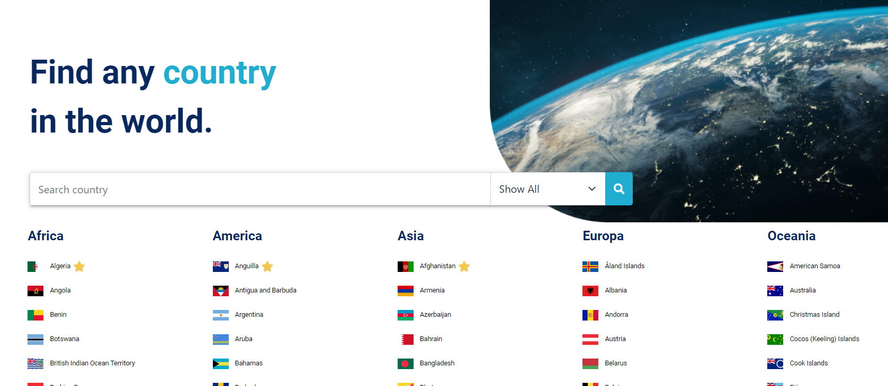

<h1> CountriesApp </h1>

 
This project was generated with [Angular CLI](https://github.com/angular/angular-cli) version 10.0.4.

## Api Rest

https://restcountries.eu/rest/v2/all

## Development server

In the project directory, you can run:

- `npm install`
- `npm start`

You can also run `ng serve` for a dev server. Navigate to `http://localhost:4200/`. The app will automatically reload if you change any of the source files.

## Code scaffolding

Run `ng generate component component-name` to generate a new component. You can also use `ng generate directive|pipe|service|class|guard|interface|enum|module`.

## Build

Run `ng build` to build the project. The build artifacts will be stored in the `dist/` directory. Use the `--prod` flag for a production build.

## Further help

To get more help on the Angular CLI use `ng help` or go check out the [Angular CLI README](https://github.com/angular/angular-cli/blob/master/README.md).

